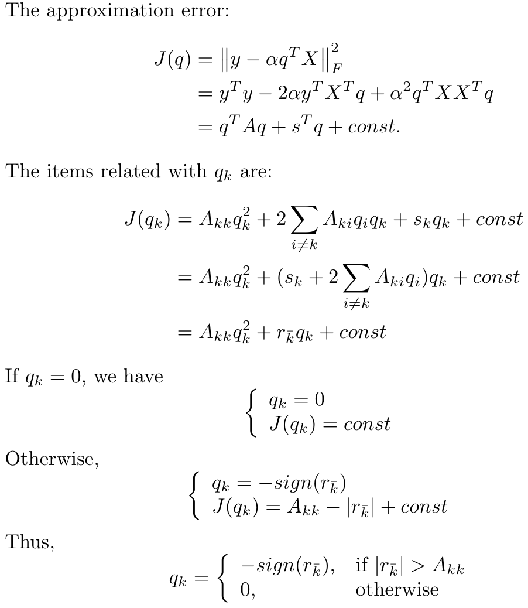

# BitSplit
BitSplit Post-trining Quantization

Code for papers:
* 'Towards Accurate Post-training Network Quantization via Bit-Split and Stitching', ICML 2020

Bit-split is a novel post-training network quantization framework where no finetuning is needed. 

A8W4 model for ResNet-18:

[BaiduCloud](https://pan.baidu.com/s/1vIrK7nIuMWZ2CkJ5jUpGWw) Extraction Code: bsci 

[GoogleDrive](https://drive.google.com/drive/folders/1Tvnbk0RUJul_0pMcBFBKEduImuYVqp3C?usp=sharing)

# Files:
* main_quant_resnet18_twostep: slow version, separately extract features for different layers.
* main_quant_resnet18_twostep_fast: fast version, extract features for all layers in parallel (should be accomplished in around 15 min).

# Train:
    CUDA_VISIBLE_DEVICES=0 python main_quant_resnet18_twostep_fast.py -a resnet18_quan --pretrained ~/data/cnn_models/pytorch/resnet/resnet18-5c106cde.pth --act-bit-width 8 --weight-bit-width 4

# Test:
    CUDA_VISIBLE_DEVICES=0 python main_quant_resnet18_twostep_fast.py -a resnet18_quan --pretrained ./resnet18_quan/A8W4/state_dict.pth --scales resnet18_quan/A8W4/act_8_scales.npy --act-bit-width 8 --weight-bit-width 4 --evaluate 

# MaskCOV migration

This fork also registers MaskCOV models and data readers migrated from
`/home/yxh/Downloads/MaskCOV-main/PR_MaskCOV`.

* Model factories: `maskcov_resnet50`, `maskcov_resnet50_quan`,
  `maskcov_resnet101`, `maskcov_resnet101_quan`.
* Data format: `DATA_ROOT/images/...` plus annotation files
  `DATA_ROOT/anno/train.txt`, `val.txt`, `test.txt`; each annotation line is
  `relative/image_name label`, and labels are converted from 1-based to 0-based.
* PTQ entry:

    CUDA_VISIBLE_DEVICES=0 python main_quant_maskcov_twostep.py \
        --dataset soybean_gene \
        --data-root /path/to/soybean_gene \
        -a maskcov_resnet50_quan \
        --pretrained /path/to/best_model.pth \
        --act-bit-width 8 \
        --weight-bit-width 4

* Evaluate a quantized checkpoint:

    CUDA_VISIBLE_DEVICES=0 python main_quant_maskcov_twostep.py \
        --dataset soybean_gene \
        --data-root /path/to/soybean_gene \
        -a maskcov_resnet50_quan \
        --pretrained maskcov_resnet50_quan/soybean_gene_A8W4/state_dict.pth \
        --scales maskcov_resnet50_quan/soybean_gene_A8W4/act_8_scales.npy \
        --evaluate

# Results:

    \* Acc@1 69.146 Acc@5 88.670

# Derivation of Eq.(5):

# Related Papers

    @InProceedings{Wang_2020_ICML,
        author = {Wang, Peisong, Qiang Chen, Xiangyu He, and Cheng, Jian},
        title = {Towards Accurate Post-training Network Quantization via Bit-Split and Stitching},
        booktitle = {Proceedings of the 37nd International Conference on Machine Learning (ICML)},
        month = {July},
        pages = {243--252},
        year = {2020}
    } 
